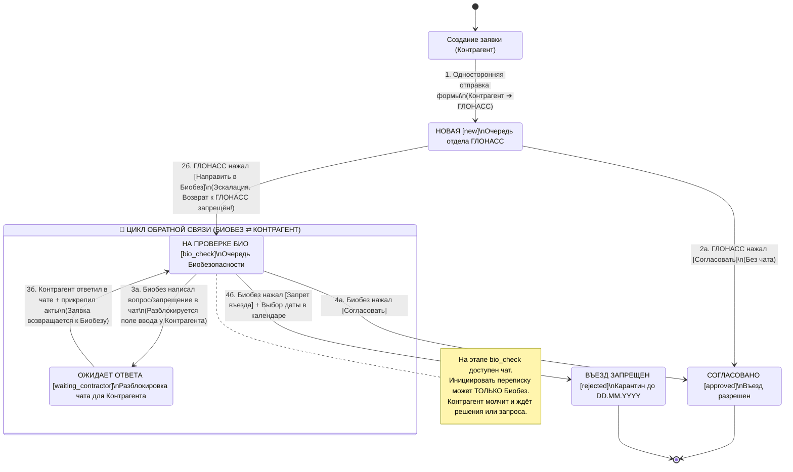

# MASTER PLAN: Система обработки заявок на проезд транспортных средств (ТС) и био-логистического контроля

## 1. Архитектурное видение (Executive Summary)
Система представляет собой специализированное веб-приложение для двухэтапной фильтрации и контроля допуска транспортных средств (ТС) контрагентов на предприятие с повышенными требованиями к биологической и логистической безопасности. 

**Ключевая архитектурная цель**: Устранение хаоса, спама и несанкционированных переписок, свойственных общей электронной почте, за счёт жёсткой ролевой изоляции, однонаправленных маршрутов эскалации и строгого регламента текстовых коммуникаций.

**Стек технологий**:
* **Backend**: Django 4.x/5.x + PostgreSQL. Использование Django ORM, специализированных индексов (B-Tree/GIN) для мгновенного поиска по номерам ТС и комментариям, и слоя сервисов (State Machine) для ролевой валидации на уровне API.
* **Frontend (Premium UI/UX Redesign)**: Django Templates + Tailwind CSS + Vanilla JS / HTMX. Проект предусматривает **полный редизайн интерфейса** с акцентом на современную премиальную эстетичную визуализацию (тёмные и светлые палитры, эргономичная таблица Dashboard, плавные микроанимации Drag&Drop зон и динамическая подгрузка чата без перезагрузки страницы).
* **Storage**: Изолированное хранилище документов (актов дезинфекции, гарантийных писем), исключающее доступ сторонних лиц.

---

## 2. Строгий регламент коммуникации и маршрутизации (Кто кому пишет и возвращает)

Для обеспечения безопасности и комфортной работы модераторов (ГЛОНАСС и Биобезопасность) в системе вводятся фундаментальные правила передачи заявок и ведения диалога.

### 2.1. Матрица передачи заявок (Кто куда может передать или вернуть карточку)
* **Контрагент ➔ ГЛОНАСС (Односторонняя подача)**: 
  * Контрагент создает заявку. Она мгновенно попадает в очередь ГЛОНАСС (статус `new`).
  * *Обратного пути нет*: Контрагент не может отозвать или изменить отправленную форму, если она в работе.
* **ГЛОНАСС ➔ Согласователям (Завершение)**:
  * Если маршрут за 72 часа чист, ГЛОНАСС нажимает `[Согласовать]`. Заявка переходит в статус `approved`. Работа завершена.
* **ГЛОНАСС ➔ Биобезопасность (Эскалация спорной ситуации)**:
  * Если по маршруту или грузу есть сомнения, ГЛОНАСС нажимает `[Направить в Биобез]`. Заявка уходит со стола ГЛОНАСС во «Входящие» Биобеза (статус `bio_check`).
* **Биобезопасность ➔ ГЛОНАСС (ВОЗВРАТ ЗАПРЕЩЁН)**:
  * Модераторы 2-й линии (Биобез) **НЕ МОГУТ вернуть заявку обратно в ГЛОНАСС**. Эскалация строго однонаправленная. Получив заявку, Биобез обязан самостоятельно принять итоговое решение.
* **Биобезопасность ⇄ Контрагент (Цикл уточнения и дозагрузки документов)**:
  * Единственный допустимый контур обратной связи. Биобез запрашивает документы (перевод в `waiting_contractor`), Контрагент отвечает (возврат в `bio_check`).
* **Биобезопасность ➔ Согласовано / Запрет (Финальный вердикт)**:
  * Биобез нажимает `[Согласовать]` (`approved`) или `[Запрет въезда]` + выбирает дату (`rejected`, карантин до DD.MM.YYYY).

### 2.2. Матрица переписки и чата (Кто кому может писать в текстовый чат)

| Вызывающая сторона ➔ Получатель | Статус коммуникации | Обоснование и правила блокировки |
| :--- | :---: | :--- |
| **Контрагент ➔ ГЛОНАСС** | 🚫 **ЗАПРЕЩЕНО** | Связь с ГЛОНАСС полностью односторонний (только отправка первоначальной формы заявки). Никакого чата или писем в адрес ГЛОНАСС не существует. |
| **ГЛОНАСС ➔ Контрагент** | 🚫 **ЗАПРЕЩЕНО** | У роли ГЛОНАСС отсутствует интерфейс внутреннего чата. Они работают исключительно кнопками маршрутизации (`[Согласовать]` или `[Направить в Биобез]`). |
| **ГЛОНАСС ⇄ Биобезопасность**| 🚫 **ЗАПРЕЩЕНО** | Передача контекста происходит исключительно путём перевода статуса на `bio_check`. Внутренний чат карточки предназначен только для верификации документов с Контрагентом. |
| **Контрагент ➔ Биобезопасность (Инициация)** | 🚫 **ЗАПРЕЩЕНО** | Контрагент **НЕ имеет права** первым написать модераторам Биобеза. При переходе заявки к Биобезу поле ввода у Контрагента заблокировано (Disabled). |
| **Биобезопасность ➔ Контрагент (Первое сообщение)** | ✅ **РАЗРЕШЕНО (Инициатор)** | **Единственный законный способ начать диалог**. Сотрудник Биобеза при необходимости пишет замечание или вопрос. Это активирует диалог и переключает статус на `waiting_contractor`. |
| **Контрагент ➔ Биобезопасность (Ответ)** | ✅ **РАЗРЕШЕНО (Только ответ)** | Как только Биобез открыл диалог и задал вопрос, поле ввода у Контрагента разблокируется. Контрагент отвечает и прикладывает файлы, после чего статус возвращается к Биобезу. |

---

## 3. Актуальный жизненный цикл заявки и циклы коммуникации (State Machine & Communication Loops)

Диаграмма ниже наглядно показывает однонаправленность проверок и чётко выделяет единственный разрешённый **Цикл Обратной Связи (Communication Loop)** между Биобезом и Контрагентом.

### Детализация этапов и циркуляции данных:
1. **Этап 1: Фильтр ГЛОНАСС (Строго в одну сторону)**
   * **Логика**: Машина попадает на 1-й уровень проверки. ГЛОНАСС сверяет данные трекеров за 72 часа. 
   * **Коммуникация**: Никаких сообщений. Никто никому не пишет. Если ГЛОНАСС всё устраивает — он даёт зелёный свет (`approved`). Если машина была в потенциальной зоне биологического риска — ГЛОНАСС нажимает `[Направить в Биобез]`.

2. **Этап 2: Фильтр Биобезопасности (Вход в зону модератора 2-й линии)**
   * **Логика**: Заявка сменила статус на `bio_check`. У ГЛОНАСС она перешла в режим только чтения. Теперь за ТС отвечает исключительно Биособезопасность.
   * **Коммуникация**: Если приложенных Контрагентом при создании документов достаточно — Биобез сразу жмет `[Согласовать]` или `[Запрет въезда]`. Диалог не открывается вообще.

3. **Этап 3: 🔄 Цикл уточнения и допроверки (Loop: Био ⇄ Контрагент)**
   * **Шаг 3.1 (Инициация Биобезом)**: Если документы сомнительны (например, истёк срок акта дезинфекции), сотрудник Био пишет в чат: *"Акт от 10.05 просрочен. Загрузите свежий акт санитарной обработки авто"*. Статус заявки **автоматически меняется на `waiting_contractor`**.
   * **Шаг 3.2 (Ответ Контрагента)**: Контрагент видит жёлтый статус `waiting_contractor` и замечание. В этот момент для него **разблокируется форма отправки в чат** внутри карточки этой конкретной заявки. Контрагент прикрепляет новый PDF/скан и пишет: *"Направляем свежий акт от сегодняшнего числа"*. Статус **автоматически возвращается на `bio_check`**.
   * *Примечание*: Этот цикл может повториться (Био снова задает вопрос ➔ Контрагент снова отвечает), пока Биобез не убедится в безопасности или не примет решение о запрете.

---

## 4. Концепция редизайна (Premium UI/UX Architecture)

Дизайн приложения будет переработан с нуля для создания впечатляющего современного визуального стиля (Wow-эффекта), уходящего от скучных корпоративных таблиц к премиальному эргономичному веб-приложению.

### 4.1. Визуальная эстетика и дизайн-система
* **Палитры и Типографика**: Использование современного шрифта (Inter/Outfit), аккуратных скруглений (border-radius: 0.5rem - 0.75rem), лёгких эффектов матового стекла (glassmorphism для модальных карточек) и высококонтрастной цветовой кодировки статусов.
* **Микроанимации и Отзывчивость**: Плавные анимации появления модальных окон, визуальная подсветка Drag&Drop зон при перетаскивании файлов, мгновенное появление новых сообщений в ленте чата.
* **Колоринг статусов**:
  * `approved` (Согласовано) — яркий изумрудно-зелёный бэдж с иконкой галочки.
  * `bio_check` / `waiting_contractor` (В работе / Ждём ответа) — тёплый янтарно-жёлтый или оранжевый бэдж с анимацией индикации активности.
  * `rejected` (Въезд запрещен) — неоново-красный бэдж с таймером окончания карантина («Заказчик заблокирован до DD.MM.YYYY»).

### 4.2. Панель управления модераторов (Dashboard ГЛОНАСС / Биобез)
* **Верхняя панель фильтрации и поиска (Powerful Search & Filter Engine)**:
  * *Поиск по Контрагенту (Search Bar с автодополнением)*: Поиск по наименованию организации или ФИО/логину пользователя.
  * *Глобальный текстовый поиск*: Полнотекстовый поиск по всем полям (включая поиск по логинам/паролям трекинговых систем в комментариях).
  * *Поиск по ТС*: Быстрый фильтр по Гос. номеру ТС (ILIKE / частичное совпадение, без учёта регистра).
  * *Фильтр по статусам (Чекбоксы / Multi-select)*: Новые, На проверке Биобезопасности, Ожидает ответа от контрагента, Согласовано, Въезд запрещен.
  * *Фильтры по датам*: Период создания («С... По...») и специализированный фильтр «Дата окончания запрета въезда».
* **Таблица заявок (Data Grid)**:
  * Колонки: `ID / Дата создания`, `Контрагент (Организация)`, `Гос. номер ТС`, `Маршрут (Загрузка -> Выгрузка)`, `Статус`.

### 4.3. Интерактивная карточка заявки (Split-View Detail Page / Modal)
Экран модального окна или детальной страницы жестко разделён на две вертикальные секции (50/50 или 40/60):
* **Левая часть (Информация и Контроль)**:
  * Полные сводные данные, заполненные Контрагентом (Маршрут, Груз, ТС, Организация, Комментарии с логинами).
  * Список вложений (сканированные акты, письма) с иконками форматов (PDF/JPG/DOC).
  * Блок кнопок принятия решений (строго в зависимости от роли модератора):
    * *ГЛОНАСС*: Кнопки `[Согласовать]` и `[Направить в Биобез]`.
    * *Биобез*: Кнопки `[Согласовать]` и `[Запрет въезда]` (вызов интерактивного всплывающего календаря DatePicker).
* **Правая часть (История аудита и Внутренний чат)**:
  * *История действий (Аудит-лог)*: Зафиксированные таймстампы всех действий (Кто создал, когда ГЛОНАСС проверил и нажал кнопку, сменился статус).
  * *Лента переписки (Внутренний чат)*: 
    * Для роли **ГЛОНАСС**: блок скрыт или отображает информационный баннер *"Диалоги с контрагентами ведутся исключительно отделом Биобезопасности"*.
    * Для роли **Биобезопасность**: полнофункциональный чат с возможностью загрузки файлов и отправки замечаний.
    * Для роли **Контрагент**: блок отображается, но поле ввода заблокировано (Disabled), если Биобез еще не инициировал переписку (заявка не в статусе `waiting_contractor`).

---

## 5. План реализации по фазам (Roadmap)
1. **Фаза 1**: Очистка легаси-моделей (удаление общей почты `DirectMessage`), актуализация модели `Ticket`, настройка индексов в БД (PostgreSQL B-Tree/GIN).
2. **Фаза 2**: Написание слоя State Machine (`services.py`) и жёстких проверок прав (`permissions.py`), реализующих запреты коммуникаций из Раздела 2.
3. **Фаза 3**: Реализация Backend API, сложных фильтров Dashboard и автоматического переключения статусов `bio_check` ⇄ `waiting_contractor` при отправке сообщений в чате.
4. **Фаза 4**: Полный UI-редизайн шаблонов (Tailwind CSS, Drag&Drop, модальные split-view карточки, матовое стекло, эргономика).
5. **Фаза 5**: Юнит-тестирование безопасности изоляции ролей и стресс-тестирование фильтрации.
